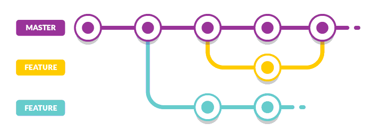

# Comment travailler à plusieurs sur un même projet avec GIT ?
 
- **Avec les branches évidemment !** :herb:
- Mouais, il a fumé lui :unamused:
- Attend de voir le concept et on s'en reparle après, ok ? :muscle:

## Principe des branches
- **Pour le moment, tu as toujours travaillé sur la branche `master`**
  - quoi ? j'étais assis sur une branche et on ne m'a rien dit ! :scream:
- Mais du coup, **c'est quoi une branche ?**
  - **une branche est un historique des modifications du code** (= suite de commits)
  - chaque branche est **indépendante** et a donc son **propre historique**
  - on ne peut être que sur **une seule branche à la fois**
  - ce qui est commité sur une branche **n'est pas répercuté** sur les autres branches
  - mais il est possible de **récupérer les commits d'une autre branche** dans la branche courante :
    - on appelle ça **fusionner 2 branches** (`merge` en anglais)
  - enfin, **quand on crée une branche**, on ne repart pas de *zéro*, **on fait une "copie"** de la branche courante

Schéma d'utilisation des branches

**Ce schéma présente un projet ayant comporté jusqu'à 3 branches en parallèles :**
  - les branches features (jaune et verte) ont bien été créées à partir de `master`
  - la branche feature jaune a été fusionnée dans `master`
  - la branche feature verte a poursuivi son évolution indépendamment des 2 autres branches

**On remarque également que les branches "feature" jaune et verte partent de la branche master :**
  - en effet, quand on crée une branche, la bonne pratique est de repartir de la branche `master`
  - la branche `master` est la branche _censée_ être la plus stable puisque c'est généralement celle utilisée pour déployer le code en production

Lors de la création de la branche à partir de `master`, c'est comme si on faisait une _copie_ de la branche `master` :
  - on ne part pas de _zéro_
  - au contraire, on repart avec *tout l'historique des commits* de `master`
  - une fois créée, la nouvelle branche gère *son propre historique* et vit sa vie _indépendamment_ de la branche `master`

Une fois que la branche jaune a terminé sa fonctionnalité, on en fait bénéficier la branche `master`:
  - on _fusionne_ alors la branche jaune dans la branche `master`
  

## Et concrètement, sinon ?
- Prenons l'exemple d'un **projet avec plusieurs fonctionnalités/correctifs** en cours de développement :

  - une **fonctionnalité** demandant _10j de dév_ => refonte design page d'accueil
  - une **fonctionnalité** demandant _45j de dév_ => statistiques des ventes dans le back-office
  - un **correctif** demandant _2j de dév_ => fix de sécurité login des utilisateurs

- **Ces 3 développements sont indépendants** :+1: mais :

  - ils n'ont pas forcément débuté le même jour :grimacing:
  - ils possèdent des temps de développement différents :grimacing:
  - la date de déploiement de chaque développement sera sans doute différente :grimacing:

- En effet, on déploiera le correctif de sécurité au plus vite mais comment faire si on a déjà commencé à développer une autre fonctionnalité sur `master` ? :cold_sweat:

  - car si l'on veut **déployer notre fix de sécurité**, on sera **obligé d'envoyer le code**, _non finalisé_ et _rempli de bugs_, des **2 autres fonctionnalités en cours** :bomb:
  - pas sûr que notre client apprécie de voir son site web exploser en plein vol :boom:

- Par contre, **si on code chaque fonctionnalité/correctif sur sa propre branche** :

  - on travaille sur chaque développement de façon **indépendante**
  - on peut donc **déployer chaque développement dès qu'il est prêt** sans tenir compte du code des autres branches

**=> Les branches permettent de travailler sur plusieurs fonctionnalités/correctifs en parallèle**

Autre schéma d'utilisation des branches

## Prêt à pratiquer ?
[Voici les instructions](./instructions.md).
